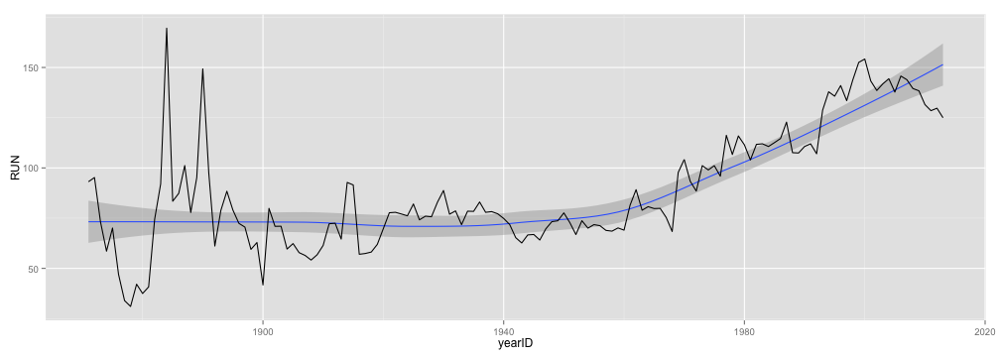
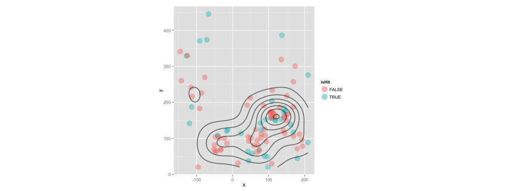

## 工欲善其事，必先利其器


```r
# install.packages("Lahman")
library(Lahman)
library(dplyr)
totalRS <- Teams %>% select(yearID, R, G) %>% mutate(AvgRperG = R/G) %>% group_by(yearID) %>% summarise(sum(AvgRperG))
names(totalRS) <- c("yearID", "RUN")
head(totalRS)
```

```
## Source: local data frame [6 x 2]
## 
##   yearID      RUN
## 1   1871 93.12897
## 2   1872 95.21474
## 3   1873 73.15998
## 4   1874 58.55903
## 5   1875 70.08774
## 6   1876 47.01267
```

---

## 工欲善其事，必先利其器


```r
library(ggplot2)
ggplot(data = totalRS, aes(x = yearID, y = RUN)) + stat_smooth() + geom_line()
```

```
## geom_smooth: method="auto" and size of largest group is <1000, so using loess. Use 'method = x' to change the smoothing method.
```

 

---

## 工欲善其事，必先利其器


```r
library(Lahman)
library(dplyr)
head(filter(Pitching, playerID == "wangch01"))
```

```
##   playerID yearID stint teamID lgID  W L  G GS CG SHO SV IPouts   H ER HR
## 1 wangch01   2005     1    NYA   AL  8 5 18 17  0   0  0    349 113 52  9
## 2 wangch01   2006     1    NYA   AL 19 6 34 33  2   1  1    654 233 88 12
## 3 wangch01   2007     1    NYA   AL 19 7 30 30  1   0  0    598 199 82  9
## 4 wangch01   2008     1    NYA   AL  8 2 15 15  1   0  0    285  90 43  4
## 5 wangch01   2009     1    NYA   AL  1 6 12  9  0   0  0    126  66 45  7
## 6 wangch01   2011     1    WAS   NL  4 3 11 11  0   0  0    187  67 28  8
##   BB  SO BAOpp  ERA IBB WP HBP BK BFP GF  R SH SF GIDP
## 1 32  47    NA 4.02   3  3   6  0 486  0 58 NA NA   NA
## 2 52  76    NA 3.63   4  6   2  1 900  1 92 NA NA   NA
## 3 59 104    NA 3.70   1  9   8  1 823  0 84 NA NA   NA
## 4 35  54    NA 4.07   1  0   3  0 402  0 44 NA NA   NA
## 5 19  29    NA 9.64   1  3   2  0 206  2 46 NA NA   NA
## 6 13  25    NA 4.04   0  2   1  0 264  0 35 NA NA   NA
```

---

## 工欲善其事，必先利其器


```r
# install.packages("Sxslt", repos = "http://www.omegahat.org/R", type = "source")
# require(devtools)
# install_github("openWAR", "beanumber")
require(openWAR)
getGameIds(date=as.Date("2015-08-21"))
```

```
## 
## Retrieving data from 2015-08-21 ...
## ...found 15 games
```

```
##  [1] "gid_2015_08_21_arimlb_cinmlb_1" "gid_2015_08_21_atlmlb_chnmlb_1"
##  [3] "gid_2015_08_21_chamlb_seamlb_1" "gid_2015_08_21_clemlb_nyamlb_1"
##  [5] "gid_2015_08_21_kcamlb_bosmlb_1" "gid_2015_08_21_lanmlb_houmlb_1"
##  [7] "gid_2015_08_21_milmlb_wasmlb_1" "gid_2015_08_21_minmlb_balmlb_1"
##  [9] "gid_2015_08_21_nynmlb_colmlb_1" "gid_2015_08_21_phimlb_miamlb_1"
## [11] "gid_2015_08_21_sfnmlb_pitmlb_1" "gid_2015_08_21_slnmlb_sdnmlb_1"
## [13] "gid_2015_08_21_tbamlb_oakmlb_1" "gid_2015_08_21_texmlb_detmlb_1"
## [15] "gid_2015_08_21_tormlb_anamlb_1"
```

---

## 工欲善其事，必先利其器


```r
gd = gameday(gameId="gid_2015_08_21_tormlb_anamlb_1")
```

```
## gid_2015_08_21_tormlb_anamlb_1
```

```r
gd$url
```

```
##                                                                                                        bis_boxscore.xml 
##      "http://gd2.mlb.com/components/game/mlb/year_2015/month_08/day_21/gid_2015_08_21_tormlb_anamlb_1/bis_boxscore.xml" 
##                                                                                                          inning_all.xml 
## "http://gd2.mlb.com/components/game/mlb/year_2015/month_08/day_21/gid_2015_08_21_tormlb_anamlb_1/inning/inning_all.xml" 
##                                                                                                          inning_hit.xml 
## "http://gd2.mlb.com/components/game/mlb/year_2015/month_08/day_21/gid_2015_08_21_tormlb_anamlb_1/inning/inning_hit.xml" 
##                                                                                                                game.xml 
##              "http://gd2.mlb.com/components/game/mlb/year_2015/month_08/day_21/gid_2015_08_21_tormlb_anamlb_1/game.xml" 
##                                                                                                         game_events.xml 
##       "http://gd2.mlb.com/components/game/mlb/year_2015/month_08/day_21/gid_2015_08_21_tormlb_anamlb_1/game_events.xml"
```

---

## 工欲善其事，必先利其器


```r
gd$ds$inning
```

```
##  [1] 1 1 1 1 1 1 1 1 1 1 1 1 1 2 2 2 2 2 2 3 3 3 3 3 3 3 4 4 4 4 4 4 4 4 5
## [36] 5 5 5 5 5 5 5 5 6 6 6 6 6 6 6 6 6 6 7 7 7 7 7 7 7 7 7 8 8 8 8 8 8 8 8
## [71] 8 9 9 9 9 9 9 9 9
```

```r
gd$ds$description
```

```
##  [1] Shane Victorino pops out to first baseman Justin Smoak.                                                                                                                            
##  [2] Kole Calhoun flies out to center fielder Kevin Pillar.                                                                                                                             
##  [3] Mike Trout walks.                                                                                                                                                                  
##  [4] Albert Pujols lines out to right fielder Jose Bautista.                                                                                                                            
##  [5] Troy Tulowitzki strikes out swinging.                                                                                                                                              
##  [6] Josh Donaldson walks.                                                                                                                                                              
##  [7] Jose Bautista walks.   Josh Donaldson to 2nd.                                                                                                                                      
##  [8] Edwin Encarnacion walks.   Josh Donaldson to 3rd.    Jose Bautista to 2nd.                                                                                                         
##  [9] Justin Smoak pops out to shortstop Erick Aybar on the infield fly rule.                                                                                                            
## [10] Russell Martin walks.   Josh Donaldson scores.    Jose Bautista to 3rd.    Edwin Encarnacion to 2nd.                                                                               
## [11] Kevin Pillar reaches on a fielding error by left fielder Shane Victorino.   Jose Bautista scores.    Edwin Encarnacion scores.    Russell Martin to 2nd.                           
## [12] Ben Revere singles on a line drive to right fielder Kole Calhoun.   Russell Martin to 3rd.    Kevin Pillar to 2nd.                                                                 
## [13] Cliff Pennington strikes out swinging.                                                                                                                                             
## [14] C.  J.   Cron grounds out, shortstop Troy Tulowitzki to first baseman Justin Smoak.                                                                                                
## [15] Erick Aybar flies out to center fielder Kevin Pillar.                                                                                                                              
## [16] Chris Iannetta flies out to right fielder Jose Bautista.                                                                                                                           
## [17] Troy Tulowitzki grounds out, third baseman Kaleb Cowart to first baseman C.  J.   Cron.                                                                                            
## [18] Josh Donaldson grounds out, pitcher Hector Santiago to first baseman C.   Cron.                                                                                                    
## [19] Jose Bautista flies out to left fielder Shane Victorino.                                                                                                                           
## [20] Ryan Jackson called out on strikes.                                                                                                                                                
## [21] Kaleb Cowart strikes out swinging.                                                                                                                                                 
## [22] Shane Victorino pops out to second baseman Cliff Pennington.                                                                                                                       
## [23] Edwin Encarnacion called out on strikes.                                                                                                                                           
## [24] Justin Smoak grounds out, third baseman Kaleb Cowart to first baseman C.   Cron.                                                                                                   
## [25] Russell Martin reaches on a fielding error by first baseman C.  J.   Cron.                                                                                                         
## [26] Kevin Pillar pops out to second baseman Ryan Jackson.                                                                                                                              
## [27] Kole Calhoun grounds out, second baseman Cliff Pennington to first baseman Justin Smoak.                                                                                           
## [28] Mike Trout grounds out sharply, second baseman Cliff Pennington to first baseman Justin Smoak.                                                                                     
## [29] Albert Pujols grounds out, third baseman Josh Donaldson to first baseman Justin Smoak.                                                                                             
## [30] Ben Revere singles on a sharp ground ball to first baseman C.  J.   Cron.                                                                                                          
## [31] Cliff Pennington called out on strikes.                                                                                                                                            
## [32] Troy Tulowitzki flies out to left fielder Shane Victorino.                                                                                                                         
## [33] Josh Donaldson doubles (31) on a fly ball to left fielder Shane Victorino.   Ben Revere scores.                                                                                    
## [34] Jose Bautista grounds out, shortstop Erick Aybar to first baseman C.   Cron.                                                                                                       
## [35] C.  J.   Cron doubles (12) on a line drive to right fielder Jose Bautista.                                                                                                         
## [36] Erick Aybar grounds out, second baseman Cliff Pennington to first baseman Justin Smoak.   Cron to 3rd.                                                                             
## [37] Chris Iannetta doubles (8) on a soft ground ball to right fielder Jose Bautista.   C.   Cron scores.                                                                               
## [38] Ryan Jackson strikes out swinging.                                                                                                                                                 
## [39] Kaleb Cowart pops out to first baseman Justin Smoak in foul territory.                                                                                                             
## [40] Edwin Encarnacion pops out to third baseman Kaleb Cowart in foul territory.                                                                                                        
## [41] Justin Smoak lines out to left fielder Shane Victorino.                                                                                                                            
## [42] Russell Martin singles on a sharp ground ball to center fielder Mike Trout.                                                                                                        
## [43] Kevin Pillar grounds out, third baseman Kaleb Cowart to first baseman C.  J.   Cron.                                                                                               
## [44] Shane Victorino singles on a sharp ground ball to left fielder Ben Revere.                                                                                                         
## [45] Kole Calhoun singles on a ground ball to center fielder Kevin Pillar.   Shane Victorino to 2nd.                                                                                    
## [46] Mike Trout called out on strikes.                                                                                                                                                  
## [47] Albert Pujols flies out to right fielder Jose Bautista.   Shane Victorino to 3rd.                                                                                                  
## [48] C.  J.   Cron strikes out swinging.                                                                                                                                                
## [49] Ben Revere doubles (15) on a sharp ground ball to right fielder Kole Calhoun.                                                                                                      
## [50] Cliff Pennington out on a sacrifice bunt, pitcher Fernando Salas to second baseman Ryan Jackson.   Ben Revere to 3rd.                                                              
## [51] Troy Tulowitzki hit by pitch.                                                                                                                                                      
## [52] Josh Donaldson out on a sacrifice fly to left fielder Shane Victorino.   Ben Revere scores.                                                                                        
## [53] Jose Bautista lines out to right fielder Kole Calhoun.                                                                                                                             
## [54] Erick Aybar singles on a ground ball to center fielder Kevin Pillar.                                                                                                               
## [55] Chris Iannetta strikes out swinging.                                                                                                                                               
## [56] Ryan Jackson called out on strikes.                                                                                                                                                
## [57] Kaleb Cowart strikes out swinging.                                                                                                                                                 
## [58] Edwin Encarnacion singles on a fly ball to right fielder Kole Calhoun.                                                                                                             
## [59] Justin Smoak homers (12) on a line drive to center field.   Edwin Encarnacion scores.                                                                                              
## [60] Russell Martin grounds out, shortstop Erick Aybar to first baseman C.  J.   Cron.                                                                                                  
## [61] Kevin Pillar strikes out swinging.                                                                                                                                                 
## [62] Ben Revere called out on strikes.                                                                                                                                                  
## [63] Shane Victorino lines out to right fielder Jose Bautista.                                                                                                                          
## [64] Kole Calhoun homers (19) on a line drive to right center field.                                                                                                                    
## [65] Mike Trout strikes out swinging.                                                                                                                                                   
## [66] Albert Pujols flies out softly to left fielder Ben Revere.                                                                                                                         
## [67] Cliff Pennington grounds out, third baseman Kaleb Cowart to first baseman C.  J.   Cron.                                                                                           
## [68] Troy Tulowitzki doubles (23) on a sharp line drive to center fielder Mike Trout.                                                                                                   
## [69] Josh Donaldson doubles (32) on a sharp line drive to center fielder Mike Trout.   Troy Tulowitzki scores.                                                                          
## [70] Jose Bautista strikes out swinging.                                                                                                                                                
## [71] Edwin Encarnacion flies out to left fielder Shane Victorino.                                                                                                                       
## [72] C.  J.   Cron strikes out swinging.                                                                                                                                                
## [73] Erick Aybar strikes out swinging.                                                                                                                                                  
## [74] Chris Iannetta strikes out swinging.                                                                                                                                               
## [75] Justin Smoak grounds out, shortstop Erick Aybar to first baseman C.   Cron.                                                                                                        
## [76] Russell Martin flies out to left fielder Shane Victorino.                                                                                                                          
## [77] Kevin Pillar doubles (22) on a line drive to left fielder Shane Victorino.                                                                                                         
## [78] Ben Revere singles on a soft line drive to left fielder Shane Victorino.   Kevin Pillar scores.  Ben Revere advances to 3rd, on a throwing error by left fielder Shane Victorino.  
## [79] Cliff Pennington grounds out, third baseman Kaleb Cowart to first baseman C.  J.   Cron.                                                                                           
## 81 Levels: Albert Pujols flies out softly to left fielder Ben Revere.   ...
```

---

## 工欲善其事，必先利其器


```r
str(gd$ds)
```

```
## Classes 'GameDayPlays', 'tbl_df', 'tbl' and 'data.frame':	79 obs. of  62 variables:
##  $ pitcherId     : num  456034 456034 456034 456034 502327 ...
##  $ batterId      : num  425664 594777 545361 405395 453064 ...
##  $ field_teamId  : chr  "141" "141" "141" "141" ...
##  $ ab_num        : num  10 11 12 13 1 2 3 4 5 6 ...
##  $ inning        : num  1 1 1 1 1 1 1 1 1 1 ...
##  $ half          : Factor w/ 2 levels "bottom","top": 1 1 1 1 2 2 2 2 2 2 ...
##  $ balls         : num  0 1 4 2 2 4 4 4 1 4 ...
##  $ strikes       : num  1 0 2 0 3 0 2 2 2 2 ...
##  $ endOuts       : num  1 2 2 3 1 1 1 1 2 2 ...
##  $ event         : Factor w/ 16 levels "Double","Field Error",..: 10 3 15 8 14 15 15 15 10 15 ...
##  $ actionId      : num  NA NA NA NA NA NA NA NA NA NA ...
##  $ description   : Factor w/ 81 levels "Albert Pujols flies out softly to left fielder Ben Revere.  ",..: 73 52 59 4 80 39 34 25 44 69 ...
##  $ stand         : Factor w/ 2 levels "L","R": 2 1 2 2 2 2 2 2 2 2 ...
##  $ throws        : Factor w/ 2 levels "L","R": 1 1 1 1 1 1 1 1 1 1 ...
##  $ runnerMovement: chr  "" "" "[545361::1B::Walk]" "[545361:1B:::Lineout]" ...
##  $ x             : num  148.7 93.9 NA 179.2 NA ...
##  $ y             : num  166.8 91 NA 71.2 NA ...
##  $ game_type     : Factor w/ 1 level "R": 1 1 1 1 1 1 1 1 1 1 ...
##  $ home_team     : Factor w/ 1 level "ana": 1 1 1 1 1 1 1 1 1 1 ...
##  $ home_teamId   : num  108 108 108 108 108 108 108 108 108 108 ...
##  $ home_lg       : Factor w/ 1 level "AL": 1 1 1 1 1 1 1 1 1 1 ...
##  $ away_team     : Factor w/ 1 level "tor": 1 1 1 1 1 1 1 1 1 1 ...
##  $ away_teamId   : num  141 141 141 141 141 141 141 141 141 141 ...
##  $ away_lg       : Factor w/ 1 level "AL": 1 1 1 1 1 1 1 1 1 1 ...
##  $ venueId       : num  1 1 1 1 1 1 1 1 1 1 ...
##  $ stadium       : Factor w/ 1 level "Angel Stadium of Anaheim": 1 1 1 1 1 1 1 1 1 1 ...
##  $ timestamp     : chr  "2015-08-22 02:36:23" "2015-08-22 02:37:19" "2015-08-22 02:38:22" "2015-08-22 02:41:00" ...
##  $ playerId.C    : num  431145 431145 431145 431145 455104 ...
##  $ playerId.1B   : num  475253 475253 475253 475253 543068 ...
##  $ playerId.2B   : num  460060 460060 460060 460060 474249 ...
##  $ playerId.3B   : num  518626 518626 518626 518626 592230 ...
##  $ playerId.SS   : num  453064 453064 453064 453064 430947 ...
##  $ playerId.LF   : num  519184 519184 519184 519184 425664 ...
##  $ playerId.CF   : num  607680 607680 607680 607680 545361 ...
##  $ playerId.RF   : num  430832 430832 430832 430832 594777 ...
##  $ batterPos     : chr  "LF" "RF" "CF" "DH" ...
##  $ batterName    : Factor w/ 25 levels "Alvarez, J","Aybar",..: 25 4 23 17 24 7 3 8 22 13 ...
##  $ pitcherName   : Factor w/ 25 levels "Alvarez, J","Aybar",..: 16 16 16 16 21 21 21 21 21 21 ...
##  $ runsOnPlay    : int  0 0 0 0 0 0 0 0 0 1 ...
##  $ startOuts     : num  0 1 2 2 0 1 1 1 1 2 ...
##  $ runsInInning  : int  0 0 0 0 3 3 3 3 3 3 ...
##  $ runsITD       : num  0 0 0 0 0 0 0 0 0 0 ...
##  $ runsFuture    : num  0 0 0 0 3 3 3 3 3 3 ...
##  $ start1B       : chr  NA NA NA "545361" ...
##  $ start2B       : chr  NA NA NA NA ...
##  $ start3B       : chr  NA NA NA NA ...
##  $ end1B         : chr  NA NA "545361" NA ...
##  $ end2B         : chr  NA NA NA NA ...
##  $ end3B         : chr  NA NA NA NA ...
##  $ outsInInning  : num  3 3 3 3 3 3 3 3 3 3 ...
##  $ startCode     : num  0 0 0 1 0 0 1 3 7 7 ...
##  $ endCode       : num  0 0 1 0 0 1 3 7 7 7 ...
##  $ fielderId     : num  475253 607680 NA 430832 NA ...
##  $ gameId        : chr  "gid_2015_08_21_tormlb_anamlb_1" "gid_2015_08_21_tormlb_anamlb_1" "gid_2015_08_21_tormlb_anamlb_1" "gid_2015_08_21_tormlb_anamlb_1" ...
##  $ isPA          : logi  TRUE TRUE TRUE TRUE TRUE TRUE ...
##  $ isAB          : logi  TRUE TRUE FALSE TRUE TRUE FALSE ...
##  $ isHit         : logi  FALSE FALSE FALSE FALSE FALSE FALSE ...
##  $ isBIP         : logi  TRUE TRUE FALSE TRUE FALSE FALSE ...
##  $ our.x         : num  59.2 -77.6 NA 135.2 NA ...
##  $ our.y         : num  80.3 269.4 NA 318.9 NA ...
##  $ r             : num  99.8 280.4 NA 346.4 NA ...
##  $ theta         : num  0.935 1.851 NA 1.17 NA ...
```

---

## 工欲善其事，必先利其器


```r
hit <- data.frame(x = cbind(c(gd$ds$x, gd$ds$our.x)), y = cbind(c(gd$ds$y, gd$ds$our.y)), isHit = gd$ds$isHit)
# img <- jpeg::readJPEG("assets/img/670px-Set-up-a-Baseball-Diamond-Step-1.jpg")
# g <- rasterGrob(img, interpolate=TRUE)
ggplot(data = hit, aes(x = x, y = y, color = isHit)) + coord_fixed() + 
#   annotation_custom(g, xmin=-Inf, xmax=Inf, ymin=-Inf, ymax=Inf) + 
  geom_point(size = 6, alpha = 0.4) + geom_density2d(colour = "black", size = 1, alpha = 0.5)
```

 

---

## Recap

### 拿資料

- 靜態資料庫
  - [Lahman Database](http://lahman.r-forge.r-project.org/)

- 即時資料源
  - [openWAR](https://baseballwithr.wordpress.com/2014/03/17/introduction-to-openwar/)

- 隨時爬網頁
  - [httr](https://cran.r-project.org/web/packages/httr/index.html)
  - [XML](https://cran.r-project.org/web/packages/XML/index.html)
  - [RJSONIO](http://www.omegahat.org/RJSONIO/)
  - [RSelenium](http://ropensci.github.io/RSelenium/)
  - [phantomJS](http://phantomjs.org/)

---

## Recap

### 玩資料

- 賽博計量學
  - [pitchRx](http://cpsievert.github.io/pitchRx/#2D_animation)
  - [openWAR](https://baseballwithr.wordpress.com/2014/03/17/introduction-to-openwar/)
  
- 資料視覺化
  - [ggplot2](http://ggplot2.org/)
  - [recharts](http://yihui.name/recharts/)
  - [dygraphs](http://rstudio.github.io/dygraphs/)

---

## 關於視覺化，我想說的是⋯⋯


